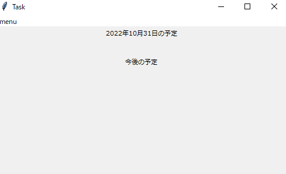
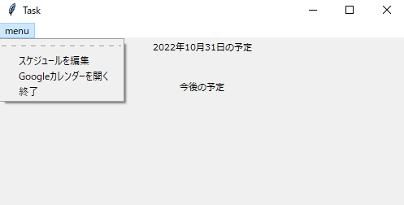
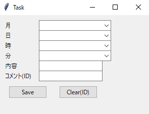
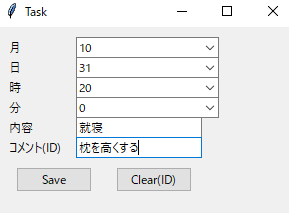
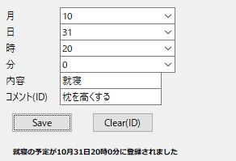
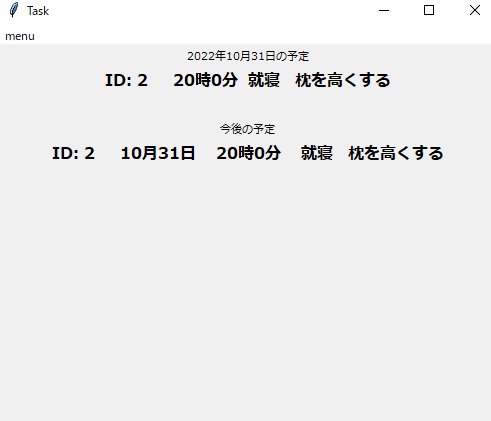
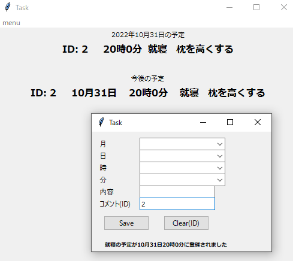
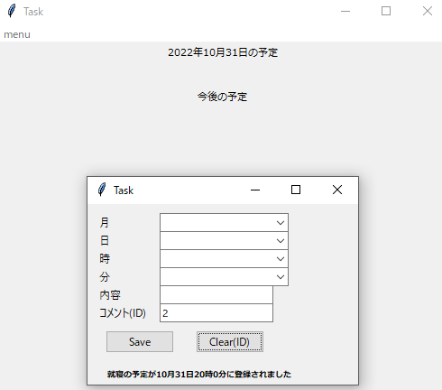

# READ ME

このアプリはTask管理用アプリケーションです。

フォルダに入っているexeをご使用ください。

作者が就活のタスク管理のため個人使用目的で作成したものになります。

---

## 簡単なアプリの説明

ホーム画面

今日の予定と今後1週間の予定を表示します。

メニュー画面です。

---

### 予定の作成・追加方法

1. メニュー画面の「スケジュールを編集」を押します。
2. 別ウインドウでスケジュール入力画面が現れます。
3. 
4. 日時と内容、コメントを入力してSaveボタンを押すと予定が保存されます。

メインウインドウにも予定が反映されました。

---

### 予定の削除方法

予定の削除には削除したい予定のIDを入力します。

Clearボタンを押します。

予定が削除されました。

---

## 使用にあたって

私的利用の範囲であれば自由に使っていただいて構いません。

---

## 注意

仮に使用に際して問題が生じても作者は責任を負いません。
自己責任でご使用ください。
また、二次頒布およびネット上での公開は禁止とさせていただきます。自作発言などもご遠慮ください。
改変はご自由にどうぞ。
